* Table of Contents
{:toc}

--------------------------------------------------------------------------------------------------------------------

## **Setting up, getting started**

Refer to the guide [_Setting up and getting started_](SettingUp.md).

--------------------------------------------------------------------------------------------------------------------

## **Design**

### Architecture

The ***Architecture Diagram*** given above explains the high-level design of the App. Given below is a quick overview of each component.

**`Main`** has two classes called [`Main`](https://github.com/AY2021S1-CS2103T-T13-2/tp/blob/master/src/main/java/quickcache/Main.java) and [`MainApp`](https://github.com/AY2021S1-CS2103T-T13-2/tp/blob/master/src/main/java/quickcache/MainApp.java). It is responsible for,
* At app launch: Initializes the components in the correct sequence, and connects them up with each other.
* At shut down: Shuts down the components and invokes cleanup methods where necessary.

[**`Commons`**](#common-classes) represents a collection of classes used by multiple other components.

The rest of the App consists of four components.

* [**`UI`**](#ui-component): The UI of the App.
* [**`Logic`**](#logic-component): The command executor.
* [**`Model`**](#model-component): Holds the data of the App in memory.
* [**`Storage`**](#storage-component): Reads data from, and writes data to, the hard disk.

Each of the four components,

* defines its *API* in an `interface` with the same name as the Component.
* exposes its functionality using a concrete `{Component Name} Manager` class (which implements the corresponding API `interface` mentioned in the previous point.)

For example, the `Logic` component (see the class diagram given below) defines its API in the `Logic.java` interface and exposes its functionality using the `LogicManager.java` class which implements the `Logic` interface.

**How the architecture components interact with each other**

The *Sequence Diagram* below shows how the components interact with each other for the scenario where the user issues the command `delete 1`.

The sections below give more details of each component.

### UI component

**API** :
[`Ui.java`](https://github.com/AY2021S1-CS2103T-T13-2/tp/blob/master/src/main/java/quickcache/ui/Ui.java)

The UI consists of a `MainWindow` that is made up of parts e.g.`CommandBox`, `ResultDisplay`, `FlashcardListPanel`, `StatusBarFooter` etc. All these, including the `MainWindow`, inherit from the abstract `UiPart` class.

The `UI` component uses [JavaFx](https://openjfx.io) UI framework. The layout of these UI parts are defined in matching `.fxml` files that are in the `src/main/resources/view` folder. For example, the layout of the [`MainWindow`](https://github.com/se-edu/addressbook-level3/tree/master/src/main/java/seedu/address/ui/MainWindow.java) is specified in [`MainWindow.fxml`](https://github.com/se-edu/addressbook-level3/tree/master/src/main/resources/view/MainWindow.fxml)

The `UI` component,

* Executes user commands using the `Logic` component.
* Listens for changes to `Model` data so that the UI can be updated with the modified data.

### Logic component

**API** :
[`Logic.java`](https://github.com/AY2021S1-CS2103T-T13-2/tp/blob/master/src/main/java/quickcache/logic/Logic.java)

1. `Logic` uses the `QuickCacheParser` class to parse the user command.
1. This results in a `Command` object which is executed by the `LogicManager`.
1. The command execution can affect the `Model` (e.g. adding a new flashcard).
1. The result of the command execution is encapsulated as a `CommandResult` object which is passed back to the `Ui`.
1. In addition, the `CommandResult` object can also instruct the `Ui` to perform certain actions, such as displaying help to the user.

Given below is the Sequence Diagram for interactions within the `Logic` component for the `execute("delete 1")` API call.

:information_source: **Note:** The lifeline for `DeleteCommandParser` should end at the destroy marker (X) but due to a limitation of PlantUML, the lifeline reaches the end of diagram.

### Model component

**API** : [`Model.java`](https://github.com/AY2021S1-CS2103T-T13-2/tp/blob/master/src/main/java/quickcache/model/Model.java)

The `Model`,

* stores a `UserPref` object that represents the user’s preferences.
* stores the quick cache flashcard data.
* exposes an unmodifiable `ObservableList<Flashcard>` that can be 'observed' e.g. the UI can be bound to this list so that the UI automatically updates when the data in the list change.
* does not depend on any of the other three components.

### Storage component

**API** : [`Storage.java`](https://github.com/AY2021S1-CS2103T-T13-2/tp/blob/master/src/main/java/quickcache/storage/Storage.java)

The `Storage` component,
* can save `UserPref` objects in json format and read it back.
* can save the address book data in json format and read it back.

### Common classes

Classes used by multiple components are in the `quickcache.commons` package.

--------------------------------------------------------------------------------------------------------------------

## **Implementation**

This section describes some noteworthy details on how certain features are implemented.

The features mentioned are:

- [Adding flashcards with open ended questions](#add-flashcard-with-open-ended-question)
- [Adding flashcards with multiple choice questions](#add-flashcard-with-multiple-choice-question)
- [Opening of flashcards](#open-flashcard)
- [Tagging system](#tags)
- [Editing a flashcard](#edit-flashcard)
- [Deleting a flashcard by index](#delete-by-index)
- [Delete by tags](#delete-by-tag)
- [Finding flashcards](#finding-flashcards)
- [Setting difficulty for flashcards](#difficulty)
- [Displaying statistics of a flashcard](#display-statistics-of-flashcard)
- [Clear statistics of a flashcard](#clear-statistics-of-flashcard)
- [Testing a flashcard](#testing-a-flashcard)
- [Export](#exporting-flashcards)
- [Import](#importing-flashcards)

### Add Flashcard with open-ended question

#### Implementation
The Add Open Ended Question mechanism is facilitated by `QuickCache`.
The flashcard created is stored internally inside a `UniqueFlashcardList` within the `QuickCache` object.

##### Usage
Given below is an example usage scenario and how the mechanism behaves at each step.

Step 1. The user launches the application for the first time. `QuickCache` will be initialized with the initial state.

Step 2. The user executes `add q/question...` command to add a flashcard. This will result in the creation of a flashcard with an open-ended question inside `QuickCache`.

:information_source: **Note:** If a command fails its execution, QuickCache will not create the flashcard.

The following sequence diagram shows how the Parser operation works:

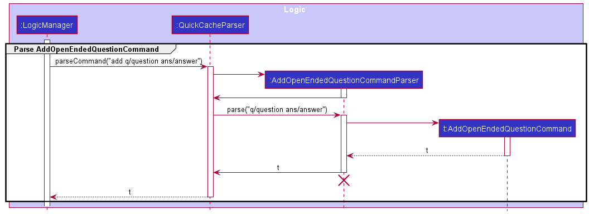

The following sequence diagram shows how the Add Open Ended Question mechanism works:

#### Design considerations

* **Current implementation:** Flashcard is saved upon creation inside the QuickCache.
  * Pros: Easy to implement and CLI-optimized.
  * Cons: May be complicated in the future as there will be too many prefixes along with the `add` command.

### Add Flashcard with multiple choice question

#### Implementation

The Add Multiple Choice Question mechanism is facilitated by `QuickCache`.
The flashcard created is stored internally inside a `UniqueFlashcardList` within the `QuickCache` object.

##### Usage

Given below is an example usage scenario and how the addmcq mechanism behaves at each step.

Step 1. The user launches the application for the first time. `QuickCache` will be initialized with the initial state.

Step 2. The user executes `addmcd q/question ans/1 c/first c/second` command to add a flashcard. This will result in the creation of a flashcard with an multiple choice question inside `QuickCache`.

:information_source: **Note:** If a command fails its execution, QuickCache will not create the flashcard.

The following sequence diagram shows how the parser operation works:

The following sequence diagram shows how the Add Multiple Choice Question mechanism works:

#### Design considerations:

* **Current implementation:** Flashcard is saved upon creation inside the QuickCache.
  * Pros: Easy to implement and CLI-optimized.
  * Cons: May be complicated in the future as there will be too many prefixes along with the `addmcq` command.

### Open Flashcard

#### Implementation

The Open flashcard feature will allow the user to open a flashcard specified by the given index and display it in the GUI.
The `OpenCommandParser#parse` takes in a single `String` argument called `index`. It then parses the argument and creates an `Index` object to be passed on to
the `OpenCommand` class instance. If no argument is given, then a `CommandException` will be thrown.

During execution, the `OpenCommand` class will pass the `Question` to the GUI for it to display the`Question` of the `Flashcard` to the user.
This is be done by passing the `Question` into a `Feedback` object which is an attribute of the `CommandResult` given to the GUI.

The GUI will change the content of some of its placeholders to display the question and if available, its choices to the user.
The GUI will change the contents of its placeholders accordingly if other commands aside from another `OpenCommand` is called afterwards.

##### Usage
Given below is an example usage scenario and how the `OpenCommand` mechanism behaves at each step.

Step 1. The user launches the application for the first time. `QuickCache` will be initialized with the initial state.

Step 2. The user executes `open 1` command to display the first flashcard in the list on the GUI.

Step 3. This will call `OpenCommandParser#parse` which will then parse the arguments provided. Within the method, `ParserUtil#parseIndex` will be called to convert the user input to index of the first `Flashcard`.

Step 4. The `Index` is then passed to the `OpenCommand`

Step 5. `OpenCommand#execute` will get the `Flashcard` at the specified `Index` and get its `Question` to be passed to the GUI as part of the `Feedback` attribute within the `CommandResult`.

Step 6. The GUI will then proceed to get the `Question` from `Feedback` and display its choices and question to the user.

The following sequence diagram shows how the parser operation works:

The following sequence diagram shows how the open operation works:

#### Design considerations:

* **Current implementation:** Flashcard is taken from the last displayed list
  * Pros: Easy to implement and CLI-optimized.
  * Cons: nil

### Tags

#### Implementation

A `Tag` is stored internally in a `Set<Tag>` within a `Flashcard` object.
It is is created and added to the flashcard during the parsing stage of an `add` or `addmcq` command.
Multiple tags can be created for each `Flashcard` as well.

##### Usage

Given below is an example usage scenario and how the Tag mechanism behaves at each step.

Step 1. The user launches the application for the first time. `QuickCache` will be initialized with the initial state.

Step 2. The user executes `add q/question... t/tag` command to add a flashcard with a tag inside QuickCache.

Step 3. During the execution of `AddOpenEndedQuestionCommandParser#parse` method, `ParserUtil#parseTags` will be called
to parse and create `Tag` objects for each unique tag. This will then be stored in a `Set<Tag>` called `tagList`

Step 4. The `Flashcard` will then be constructed containing the `tagList`.

#### Design considerations:

* **Current implementation:** Tag is saved within a `Set<Tag>` within `Flashcard`
  * Pros: Easy to implement and doesn't allow for duplicates.
  * Cons: Might take very long to search for flashcards with a specified tag especially if there are many flashcards.

* **Alternative:** Utilise an additional data structure for each individual tag to store flashcards.
  * Pros: Easy and fast to find flashcards with a specified tag.
  * Cons: Many duplicate copies of flashcards will be created.

### Edit Flashcard

#### Implementation

The Edit mechanism operates by editing the flashcard at a specified index of the last displayed list.
The new information is encapsulated inside a `EditFlashcardDescriptor` and is passed together with the `Index` object
to the `EditCommand`.

During `EditComamnd#execute`, a new `Flashcard` object will be created. For each of its individual content (i.e `Answer`),
if the `EditFlashcardDescriptor` does not have the new information, the old content will be from the original `Flashcard`.

##### Usage

Given below is an example usage scenario and how the edit mechanism behaves at each step.

Step 1. The user executes `edit 1 ans/answer` command to edit the answer field of the first flashcard.

Step 2. `EditCommandParser#parse` will then parse the arguments provided. In this example, a new `Answer` object will be
created after parsing.

Step 3. The `Answer` object will then be passed to the `EditFlashcardDescriptor` object. The `EditFlashcardDescriptor`
object together with the original `Flashcard` will be passed to the `EditCommand` object.

Step 4. The `EditCommand` will then create a new `Flashcard` using information from `EditFlashcardDescriptor`.
In the example, only a new answer is present. All other information will be taken from the original `Flashcard`.

Step 5. `EditCommand#execute` will then replace the old `Flashcard` in the `model` with the new `Flashcard`.

:information_source: **Note:** If a command fails its execution, it will not be saved in the QuickCache, so the flashcard inside the QuickCache will not be updated.

The following sequence diagram shows how the parser operation works:

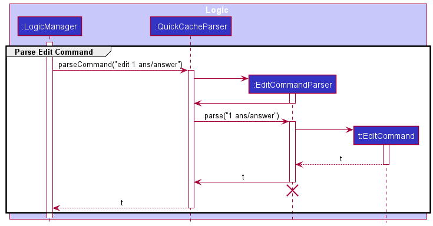

The following sequence diagram shows how the edit operation works:

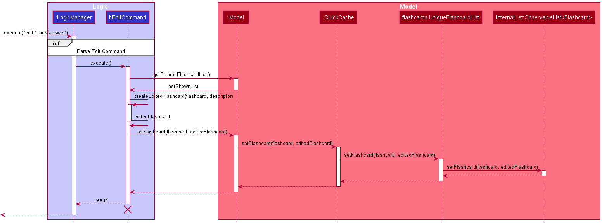

#### Design considerations:

* **Current choice:** Create a new flashcard with all the new information to replace the old flashcard.
  * Pros: Maintains immutability.
  * Cons: Difficult to implement as a seperate `EditFlashcardDescriptor` class must be implemented as well.

* **Alternative:** Edit the old flashcard directly.
  * Pros: Much easier to implement.
  * Cons: If the execution is stopped halfway, then the newly updated flashcard will contain wrong information. It will
  be difficult to debug as well.

### Delete By Index

#### Implementation

The Delete By Index mechanism deletes the flashcard at the specified index of the last displayed list.

##### Usage

Given below is an example usage scenario and how the Delete By Index mechanism behaves at each step.

Step 1. The user launches the application.

Step 2. The user executes `delete 1` command to delete the first flashcard. This command will be parsed by `DeleteCommandParser`.

Step 3. `DeleteCommandParser#parse` will then create a `DeleteCommand` which has its `isDeleteByTag` field set to `false`.
`DeleteCommandParser#parse` will also create an `Index` object to be passed to the `DeleteCommand` object.

Step 4. `DeleteCommand#execute` will then get a copy of the to-be `Flashcard` from the `model` using the `Index` provided.

Step 5. The `model#deleteFlashcard` will then delete the `Flashcard` by finding for it based on its copy.

:information_source: **Note:** If a command fails its execution, it will not be saved in the QuickCache, so the flashcard inside the QuickCache will not be updated.

The following sequence diagram shows how the Delete By Index mechanism works:

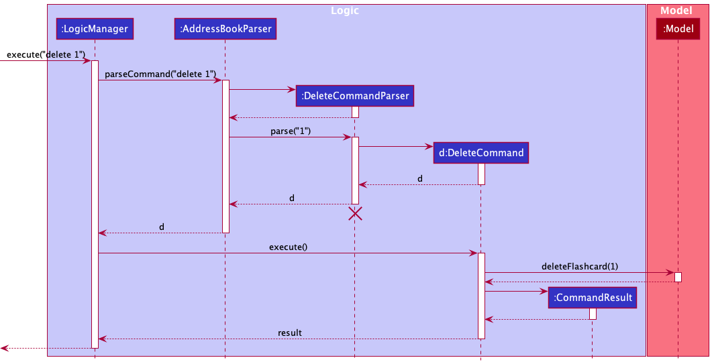

#### Design considerations:

* **Current choice:** Delete command works for both index and tags
  * Pros: Convenient for the user as there is only one command.
  * Cons: Extra checks have to be implemented to make sure that the correct deletion mechanism is executed.

* **Alternative:** Create a seperate delete command for deleting by tags
  * Pros: Less overlapping and easier to debug.
  * Cons: Extra work needed to implement the delete command.

### Delete By Tag

#### Implementation

The Delete By Tag mechanism will delete flashcards specified by a given set of tags. Any flashcard containing
at least one of the specified tags will be deleted.

It works by filtering for the flashcards in the `model` and deleting them one by one.

##### Usage

Given below is an example usage scenario and how the Delete By Tag mechanism behaves at each step.

 Step 1. The user launches the application.

 Step 2. The user executes `delete t/MCQ` command to delete all flashcards with the tag `MCQ`.

 Step 3. This will call `DeleteCommandParser#parse` which will then parse the arguments provided.
 Within `DeleteCommandParser#parse`, `ParserUtil#parseTags` will be called to create a `FlashcardPredicate` using the tags.

 Step 4. A new `DeleteCommand` object will be created with its `isDeleteByTag` field set to `true`. The `FlashcardPredicate`
 will also be passed to the `DeleteCommand` object.

 Step 5. `DeleteCommand#execute` will filter the `QuickCache` model with the provided predicate and get back the filtered list

 Step 6. It will then iterate through the list and call `QuickCache#deleteFlashcard` on each `Flashcard` in the list.

The following sequence diagram shows how the Delete By Tag mechanism works:

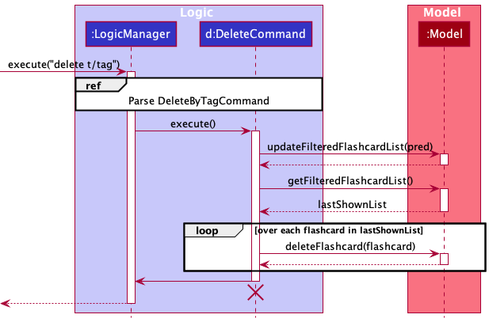

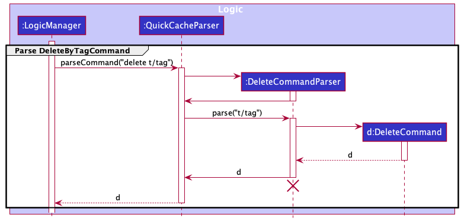

#### Design considerations:

* **Current choice:** Delete command works for both index and tags
  * Pros: Convenient for the user as there is only one command.
  * Cons: Extra checks have to be implemented to make sure that the correct deletion mechanism is executed.

* **Alternative:** Create a seperate delete command for deleting by tags
  * Pros: Less overlapping and easier to debug.
  * Cons: Extra work needed to implement the delete command.

### Finding flashcards

#### Implementation

The Find mechanism searches for flashcards based on the specified tag or question keyword or both.
Each filter will result in the creation of a `Predicate<Flashcard>`.
A class called `FlashcardPredicate` will be introduced that collects all `Predicate<Flashcard>` into one class.

##### Usage

Given below is an example usage scenario and how the `FindCommand` mechanism behaves at each step.

 Step 1. The user launches the application.

 Step 2. The user executes `find t/Assembly q/What` command to find a `Flashcard` with the tag `Assembly` and the keyword `What` in its `Question`.

 Step 3. This will call `FindCommandParser#parse` which will then parse the arguments provided.
 Within the method, `ParserUtil#parseTags`and `Parserutil#parseKeywords` will be called to create tags and keywords for the arguments.

 Step 4. A new `FlashcardPredicate` will then be created from the `QuestionContainsKeywordsPredicate` and `FlashcardContainsTagPredicate` generated from the given tags and keywords.
 It will be used to filter for all the flashcards that have the specified tags. This `FlashcardPredicate` is then passed to the `FindCommand`

 Step 5. `FindCommand#execute` will set the `QuickCache` model's filter with the provided predicate.

 Step 6. The GUI will then proceed to get the filtered list based on the newly set predicate to display to the user.

 Step 7. After execution, `CommandResult` will contain a message indicating that it has listed all `Flashcards` based on the specified restrictions.

 The following sequence diagram shows how the parser operation works:

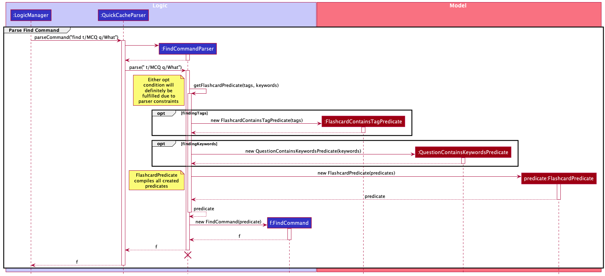

 The following sequence diagram shows how the find operation works:

#### Design considerations

* **Current choice:** Use a `FlashcardPredicate` to filter for the `Flashcard`s.
  * Pros: `FlashcardPredicate` can be extended to be used for other operations.
  * Cons: *nil*

### Difficulty

#### Implementation

The Difficulty mechanism is facilitated by storing a `Difficulty` object inside a `Flashcard` object.

The `Difficulty` class takes difficulty levels from `Difficulties` enums which contains four difficulty levels `LOW`, `MEDIUM`, `HIGH` and `UNSPECIFIED`.

##### Usage

Given below is an example usage scenario and how the Difficulty mechanism behaves at each step.

Step 1. The user launches the application.

Step 2. The user executes `add q/question... d/difficultyLevel` command to add a flashcard with difficulty.
If the user executes `add q/question...` command without `d/` prefix.
The `add` command will cause the addition of a flashcard with a difficulty set to `UNSPECIFIED` inside the QuickCache.

Step 3. The user executes `edit 1 d/difficultyLevel` to edit the difficulty in the first flashcard of the list.
The edit command will change the internal structure of flashcard such that the `Difficulty` is updated.

#### Design considerations:

* **Current choice:** Difficulty is saved upon creation.
  * Pros: Easy to implement.
  * Cons: May be complicated as there will be too many fields in the `add` command.

* **Alternative:** Individual command knows how to add difficulty by
  itself.
  * Pros: Will be less complicated.
  * Cons: There may be too many commands which can be combined to one.

### Testing a flashcard

#### Implementation

The test mechanism is facilitated by `Flashcard`. Specifically, `Statistics` stored within the flashcard. `Flashcard` implements the following methods.
* `Flashcard#getFlashcardAfterTestSuccess()` — Returns a new `Flashcard` object with `Statistics:timesTested` and `Statistics:timesTestedCorrect` incremented by one.
* `Flashcard#getFlashcardAfterTestFailure()` — Returns a new `Flashcard` object with `Statistics:timesTested` incremented by one.

##### Usage

Given below is an example usage scenario and how the test mechanism behaves at each step.

Step 1. The user launches the application. The `Flashcard` to be tested will be initialized with the initial flashcard state.

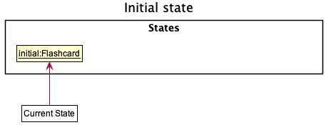

Step 2. The user tests the flashcard with a specified `answer` or `option`.

Step 2a. The user executes `test 1 ans/correct answer` command to test the `Flashcard`. The `test` command calls `Flashcard#getFlashcardAfterTestSuccess()`, and replaces the previously tested flashcard with the newly updated flashcard, changing its state.

Step 2b. The user executes `test 1 ans/wrong answer` command to test the `Flashcard`. The `test` command calls `Flashcard#getFlashcardAfterTestFailure()`, and replaces the previously tested flashcard with the newly updated flashcard, changing its state.

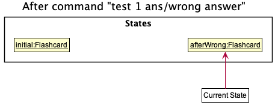

The following sequence diagram shows how the test operation works:

The following sequence diagram shows how the input get parsed:

The following activity diagram summarizes what happens when a user executes a test command on a specified flashcard:

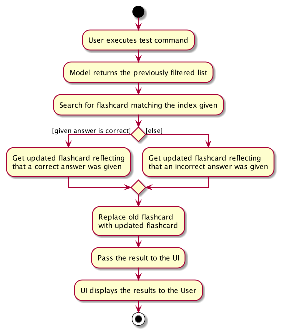

#### Design considerations:

* **Current choice:** Increments a counter of `timesTestedCorrect` and `timesTested` in `Statistics`.
  * Pros: Easy to implement.
  * Cons: Unable to keep track of useful information such as performance over time.

* **Alternative:** `Statistics` is made up of an `Array` of `test`, including information such as `timestamp`
  * Pros: Retrieval of useful statistics will be possible.
  * Cons: Save file will expand very quickly because each `test` record needs to be logged.

### Display Statistics of Flashcard

#### Implementation

The display statistics of flashcard feature will allow the user to view a Pie Chart of the statistics of the Flashcard specified by the given index and display it in the GUI.

The display statistics of flashcard implementation requires the creation of a `StatsCommandParser` and a `StatsCommand`. The `StatsCommandParser#parse` will take in a single argument for `Index`. After parsing the argument, it will then proceed to create a `StatsCommand` class instance. If no `Index` is given then a `CommandException` will be thrown.

The `StatsCommand` class will have to pass the `Statistics` to the GUI for it to display the `Statistics` of the `Flashcard` to the user. This will be done by passing the `Statistics` into a `Feedback` object which is an attribute of the `CommandResult` given to the GUI.

The GUI will change the content of some of its placeholders to display the `Statistics` as a Pie Chart. The GUI will change the contents of its placeholders accordingly if other commands aside from another `StatsCommand` is called afterwards.

##### Usage

Given below is an example usage scenario and how the `StatsCommand` mechanism behaves at each step.

Step 1. The user launches the application after a few times of using the `TestCommand` feature. The `QuickCache` will be initialized with the existing QuickCache state.

Step 2. The user executes `stats 1` command to display the `Statistics` of the first flashcard in the list on the GUI.

Step 3. This will call `StatsCommandParser#parse` which will then parse the arguments provided. Within the method, `ParserUtil#parseIndex` will be called to convert the user input into the `Index` of the first `Flashcard`.

Step 4. The `index` is then passed to the `StatsCommand`

Step 5. `StatsCommand#execute` will get the `Flashcard` at the specified `Index` and get its `Statistics` to be passed to the GUI as part of the `Feedback` attribute within the `CommandResult`.

Step 6. The GUI will then proceed to get the `Statistics` from `Feedback` and display its data in the form of a Pie Chart to the user.

The following sequence diagram shows how the parser operation works:

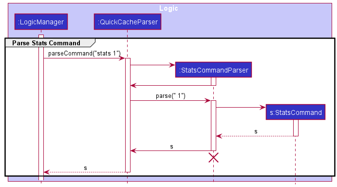

The following sequence diagram shows how the stats operation works:

#### Design Considerations:

* **Current choice:** Passes the `Statistics` object to the GUI in `Feedback` which is an attribute of `CommandResult`.
  * Pros: Provides more abstraction as all of the data the GUI needs to display are in the `Feedback` object.
  * Cons: There is a violation of Demeter's law as GUI interacts with an attribute of `CommandResult`.

* **Alternative:** Do not use the `Feedback` object. Place all the data in the `CommandResult` object directly.
  * Pros: Demeter's law is no longer violated.
  * Cons: There is less abstraction.

### Clear Statistics of Flashcard

#### Implementation

The clear statistics of flashcard feature will allow the user to reset the statistics of the flashcard specified by the given index.

The clear statistics of flashcard implementation requires the creation of a `ClearStatsCommandParser` and a `ClearStatsCommand`. The `ClearStatsCommandParser#parse` will take in a single argument for `Index`. After parsing the argument, it will then proceed to create a `ClearStatsCommand` class instance. If no `Index` is given then a `CommandException` will be thrown.

The `ClearStatsCommand` class will replace the `Flashcard` at the specified `Index` with a copy of the original `Flashcard` that has its `Statistics` reset to zero for all fields.

##### Usage

Given below is an example usage scenario and how the `ClearStatsCommand` mechanism behaves at each step.

Step 1. The user launches the application after a few times of using the `TestCommand` feature. The `QuickCache` will be initialized with the existing QuickCache state.

Step 2. The user executes `stats 1` command to display the `Statistics` of the first flashcard in the list on the GUI. The user sees that the `Statistics` has values that are not zero.

Step 3. The user executes `clearstats 1` command to clear the `Statistics` of the first flashcard in the list on the GUI.

Step 4. This will call `ClearStatsCommandParser#parse` which will then parse the arguments provided. Within the method, `ParserUtil#parseIndex` will be called to convert the user input into the `Index` of the first `Flashcard`.

Step 5. The `index` is then passed to the `ClearStatsCommand`

Step 6. `ClearStatsCommand#execute` will get the `Flashcard` at the specified `Index` and call `ClearStatsCommand#getFlashcardAfterClearStatistics` which will give a copy of the original `Flashcard` with its `Statistics` reset to zero for all fields. The original `Flashcard` will then be replaced by the new `Flashcard` copy.

Step 7. After execution, `CommandResult` will contain a message indicating that it has cleared the `Statistics` of the `Flashcard` on the specified index.

Step 7. The user executes `stats 1` command to display the `Statistics` of the first flashcard in the list on the GUI. The user sees that the `Statistics` is reset.

The following sequence diagram shows how the parser operation works:

The following sequence diagram shows how the Clearstats operation works:

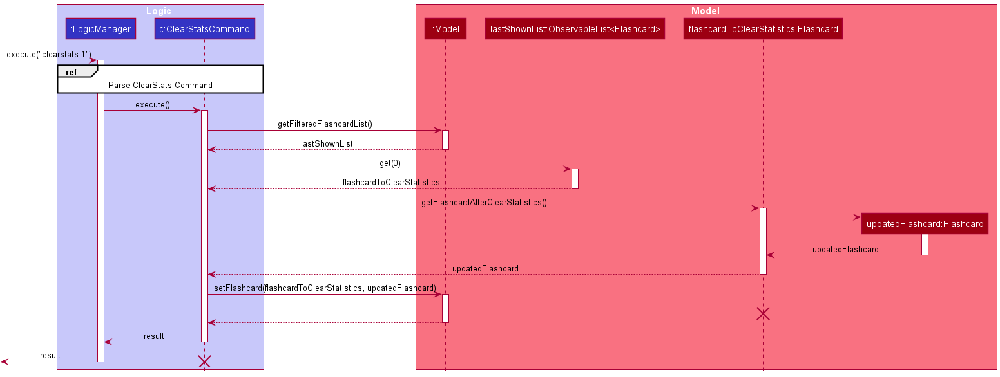

#### Design Considerations:

* **Current choice:** Replaces the existing `Flashcard` with a new `Flashcard` that has a new `Statistics` with all attributes set at zero.
  * Pros: `Flashcard` and `Statistics` are easier to debug.
  * Cons: Waste of resources as new `Flashcard` and `Statistics` objects need to be created when a user wants to clear its statistics.

* **Alternative:** Edit the `Statistics` of the `Flashcard` directly
  * Pros: No "unnecessary" creation of a new `Flashcard` and `Statistics` object when a user requests to clear its statistics.
  * Cons: `Flashcard` and `Statisitcs` become difficult to debug.

### Exporting Flashcards

#### Implementation

The export mechanism is facilitated by `Storage` and `QuickCache`. `Storage` is used to interact with the users local data, and a new `QuickCache` containing the data to be exported is passed to `Storage` to save to local data.

##### Usage

Given below is an example usage scenario and how the export mechanism behaves at each step.

Step 1. The user inputs the `find t/cs2100` command to find all `Flashcard` containing the tag `cs2100`. The `Model` updates its current filtered flashcard list.

Step 2. The user inputs the `export out.json` command. The following sequence diagram shows how the input command gets parsed:

Step 3. The parsed `Export` command is executed. The current filtered flashcard list is exported to `out.json`, located in the `/export/` directory.

The following sequence diagram shows how the export operation works as a whole:

The following activity diagram summarizes what happens when a user executes an `Export` command:

#### Design considerations:

* **Current choice:** Predefined directory of `/export/`
  * Pros: Easy to implement.
  * Cons: The user will have to navigate to his `/export/` folder to retrieve output file.

* **Alternative:** User specifies which directory to save the export file to.
  * Pros: More control over where the export file will end up at.
  * Cons: Difficult to implement.
  * Cons: Command becomes more complicated as the entire path needs to be typed out.

### Importing Flashcards

#### Implementation

The import mechanism is similarly facilitated by `Storage` and `QuickCache`. `Storage` is used to interact with the users local data, and a new `QuickCache` containing the data to be imported is read by `Storage` from local data.

##### Usage

Given below is an example usage scenario and how the export mechanism behaves at each step.

Step 1. The user places the file `in.json` that he wants to import in his `/import/`folder.

Step 2. The user inputs the `import in.json` command. The following sequence diagram shows how the input command gets parsed:

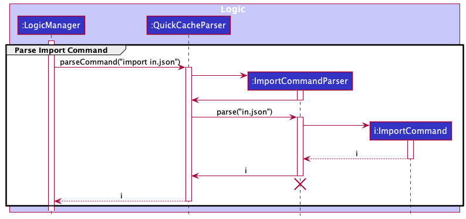

Step 3. The parsed `Import` command is executed. The flashcards from the file `in.json` is imported into his local `QuickCache`. If a flashcard has been imported before, it will not be imported again. The check for repitive flashcards is carried out using `Model#hasFlashcard` and `Flashcard#equals`.

The following sequence diagram shows how the import operation works as a whole:

The following activity diagram summarizes what happens when a user executes an `Import` command:

#### Design considerations:

* **Current choice:** Predefined directory of `/import/`
  * Pros: Easy to implement.
  * Cons: The user will have to navigate to his `/import/` folder to a place the input file in it.

* **Alternative:** User specifies which directory to save the export file to.
  * Pros: More control over where the import file can be from e.g. user's download folder.
  * Cons: Difficult to implement.
  * Cons: Command becomes more complicated as the entire path needs to be typed out.

--------------------------------------------------------------------------------------------------------------------

## **Documentation, logging, testing, configuration, dev-ops**

* [Documentation guide](Documentation.md)
* [Testing guide](Testing.md)
* [Logging guide](Logging.md)
* [Configuration guide](Configuration.md)
* [DevOps guide](DevOps.md)

--------------------------------------------------------------------------------------------------------------------

## **Appendix: Requirements**

### Product scope

**Target user profile**:

* Students with many modules who want to memorize points
* prefer desktop apps over other types
* prefers typing to mouse interactions
* is reasonably comfortable using CLI apps
* wants to monitor his/her progress

**Value proposition**: manage flashcards faster than a typical mouse/GUI driven app with
a test feature and track the progress later.

### User stories

Priorities: High (must have) - `* * *`, Medium (nice to have) - `* *`, Low (unlikely to have) - `*`

| Priority | As a …​                                    | I want to …​                     | So that I can…​                                                |
| -------- | ------------------------------------------ | ------------------------------ | ------------------------------------------------------------------------- |
| `* * *`  | new user                                   | see usage instructions         | refer to instructions when I forget how to use the App                    |
| `* * *`  | new user                                   | have a get started             | see the features available in the app                                     |
| `* * *`  | new user                                   | have a sample data             | explore more about the app                                                |
| `* * *`  | new user                                   | purge all current data         | delete the sample data for exploring the app                              |
| `* * *`  | user                                       | add a new flashcard            |                                                                           |
| `* * *`  | user                                       | delete a flashcard             | remove flashcards that I no longer need                                   |
| `* *`    | user                                       | find a flashcard by name       | locate details of flashcards without having to go through the entire list |
| `* *`    | user                                       | edit a flashcard               |                                                                           |
| `* *`    | user                                       | quiz myself                    | memorize things better                                                    |
| `* *`    | user                                       | organize my flashcard          |                                                                           |
| `* *`    | user                                       | categorize my flashcards       | easily find the flashcard associated with the category                    |
| `* *`    | user                                       | import a set of flashcard      | easily add new category of flashcard                                      |
| `* *`    | user                                       | export a set of flashcard      | easily transfer a category of flashcard                                   |
| `*`      | user who has created a lot of flashcard    | delete a category of flashcard | easily transfer a category of flashcard                                   |
| `*`      | user with many flashcards in the list      | specify the importance         |                                                                           |
| `*`      | user                                       | randomize the question         | test myself better                                                        |
| `*`      | user                                       | get the statistic of quiz      | get a visualisation form of my performance                                |
| `*`      | user                                       | track the progress             | know what I have done when using the app                                  |

### Use cases

(For all use cases below, the **System** is the `QuickCache` and the **Actor** is the `user`, unless specified otherwise)

**Use case: UC01 - Explore QuickCache**

**MSS**

1.  User double clicks on QuickCache.jar
2.  QuickCache opens and shows a list of flashcards
3.  User plays around with QuickCache features to familiarize with them
4.  User purges all "get started" data

    Use case ends.

**Extensions**

* 1a. Error message indicating that QuickCache.jar cannot be opened pops up.

  * 1a1. User opens up CLI in the directory containing QuickCache and runs `java -jar QuickCache.jar`.

    Use case resumes at step 2.

* 3a. User wants to know all the available commands present in QuickCache.

  * 3a1. User requests for all the instructions available in QuickCache.

  * 3a2. QuickCache displays all available commands.

    Use case resumes at step 3.

**Use case: UC02 - View statistics of a flashcard**

**Preconditions: User has QuickCache open.**

**MSS**

1.  User requests for statistics of a flashcard
2.  QuickCache displays statistics of the flashcard
3.  User <u>tests himself with the same flashcard (UC05)</u>
4.  User requests for statistics of the flashcard
5.  QuickCache displays updated statistics of the flashcard

    Use case ends.

**Extensions**

* 1a. The given index is invalid.

  * 1a1. QuickCache shows an error message.

    Use case resumes at step 1.

**Use case: UC03 - Delete a flashcard**

**Preconditions: User has QuickCache open.**

**MSS**

1.  User requests to list flashcards
2.  QuickCache shows a list of flashcards
3.  User requests to delete a specific flashcard in the list
4.  QuickCache deletes the flashcard
5.  QuickCache updates flashcard save file (UC08)

    Use case ends.

**Extensions**

* 2a. The list is empty.

  Use case ends.

* 3a. The given index is invalid.

  * 3a1. QuickCache shows an error message.

    Use case resumes at step 2.

**Use case: UC04 - Create a flashcard with open ended question**

**Preconditions: User has QuickCache open.**

**MSS**

1.  User requests to add a flashcard
2.  QuickCache adds it to the list
3.  QuickCache updates flashcard save file (UC08)
4.  User requests to list flashcards
5.  QuickCache shows the list of flashcards including the recently added flashcard

    Use case ends.

**Extensions**

* 1a. The question is empty.

  * 1a1. QuickCache shows an error message.

    Use case ends.

* 1b. The answer is empty.

  * 1b1. QuickCache shows an error message.

    Use case ends.

**Use case: UC05 - Create a flashcard with Multiple choice question**

**Preconditions: User has QuickCache open.**

**MSS**

1.  User requests to add a flashcard
2.  QuickCache adds it to the list
3.  QuickCache updates flashcard save file (UC08)
4.  User requests to list flashcards
5.  QuickCache shows the list of flashcards including the recently added flashcard

    Use case ends.

**Extensions**

* 1a. The question is empty.

  * 1a1. QuickCache shows an error message.
    
    Use case ends.
  
* 1b. The answer is empty.

  * 1b1. QuickCache shows an error message.
    
    Use case ends.

* 1c. The choices is empty.

  * 1b1. QuickCache shows an error message.
    
    Use case ends.
    

**Use case: UC06 - Test a single flashcard**

**Actor: User**

**MSS:**

1. User requests to list flashcards
2. QuickCache shows a list of flashcards
3. User requests to test a specific flashcard in the list with a specific answer
4. QuickCache displays whether the answer is correct

    Use case ends.

**Extensions:**

* 2a. The list is empty.

  Use case ends.

* 3a. The given index is invalid.

  * 3a1. AddressBook shows an error message.

    Use case resumes at step 2.

**System: QuickCache**

**Use case: UC07 - Test a set of flashcards by category**

**Actor: User**

MSS:

1. User requests to list categories
2. QuickCache shows a list of categories
3. User requests to test a specific category in the list
4. User tests each flashcard on the list (UC06)
5. QuickCache shows the number of successful questions at the end

    Use case ends.

**Extensions:**

* 2a. The list is empty.

  Use case ends.

* 3a. The given index is invalid.

  * 3a1. QuickCache shows an error message.

    Use case resumes from step 2.

* 3b. The user specifies a time limit.

  * 3b1. QuickCache starts a timer.

    Use case resumes from step 4.

* 3c. The user specifies to randomly sort the questions.

  * 3c1. QuickCache randomizes the flashcards from the category.

    Use case resumes from step 4.

* 4a. The user answers the question.

  * 4a1. QuickCache shows the next question to answer.

  * Step 4a. is repeated until all questions in the category is answered.

    Use case resumes from step 5.

* 4b. The user cancels the test midway.

  * Use case resumes from step 5.

* 4c. The user runs out of time midway.

  * Use case resumes from step 5.

* 4d. The user closes QuickCache

  Use case ends.

**Use case: UC08 - Update flashcard save file**

**Actor: QuickCache**

MSS:

1. QuickCache accepts update request
2. QuickCache updates save file

    Use case ends.

**Extensions:**

* 2a. No save file.

  * 3a1. QuickCache creates new save file.

    Use case resumes from step 2.

* 2b. Save file corrupted.

  * 2b1. QuickCache shows an error message.

  * 2b2. QuickCache creates new save file.

    Use case resumes from step 2.

**Use case: UC09 - Import flashcard data file**

**Actor: User**

MSS:

1. User specifies the file name containing the set of flashcards to import from
2. QuickCache imports each flashcard from the file

    Use case ends.

**Extensions:**

* 1a. File not found.

  * 1a1. QuickCache shows an error message.

    Use case ends.

* 1b. Data file corrupted.

  * 1b1. QuickCache shows an error message.

    Use case ends.
    
* 2a. Duplicate flashcard found.

  * 2a1. QuickCache ignores the duplicate flashcard.
  
    Use case resumes from step 3.

**Use case: UC10 - Add tags during creation of a Flashcard**

**Actor: User**

MSS:

1. User creates a flashcard.
2. QuickCache shows a list of existing tags.
3. QuickCache asks the user to type in the tags one by one.
4. User types in the tags one by one.
5. User signals that he is finished.
6. QuickCache adds the tags to the flashcard.

    Use case ends.

**Extensions:**

* 3a. User wishes to remove a tag that he entered.

  * 3a1. User inputs the remove command to remove the tag.

    Use case resumes at step 3.

* 5a. Some of the tags are new tags

  * 5a1. QuickCache stores and remembers the tags.

    Use case ends.

**Use case: UC11 - Deleting a tag category**

**Actor: User**

MSS:

1. User wants to remove a tag category.
2. User enters the delete tag command and the name of the tag to be deleted.
3. QuickCache asks for a confirmation before deleting.
4. User gives the confirmation.
5. QuickCache deletes the tag from every Flashcard.

    Use cased ends.

**Extensions:**

* 4a. User does not give confirmation

  * 4a1. QuickCache does not delete anything.

    Use case ends.

**Use case: UC12 - Edit tags on an existing Flashcard**

**Actor: User**

MSS:

1. User wants to add tags on an existing Flashcard
2. QuickCache asks for the name of the new tag to be added.
3. User enters the new tag name
4. QuickCache adds the tag onto the Flashcard

    Use case ends.

**Extensions:**

* 1a. User wants to remove a tag

	* 1a1. User asks QuickCache to list out all the tags

	* 1a2. QuickCache lists out all the tags

	* 1a3. User enters the name of the tag to be removed

	* 1a4. QuickCache removes the tag from the Flashcard

    Use case ends.

* 1b. User wants to edit a tag

	* 1b1. User asks QuickCache to rename a tag

	* 1b2. QuickCache asks for the new name of the tag

	* 1b3. User enters the new name

	* 1b4. QuickCache updates the tag with it's new name.

    Use case ends.

**Use case: UC13 - Search for Flashcards based on Tags and/or Question**

**Actor: User**

**Preconditions: User has QuickCache open.**

**MSS**

1. User enters the tags and/or keywords associated with the flashcard he wants to search for
2. QuickCache filters all existing flashcards based on the tag and/or keywords.
3. Quickcache displays all the requested flashcards to the user.

    Use case ends.

**Use case: UC14 - Open a single flashcard**

**MSS**

1. User double clicks on QuickCache.jar
2. QuickCache opens and shows a list of flashcards
3. User forgets the choices of a flashcard's question
4. User requests to open a specific flashcard in the list
5. QuickCache opens the flashcard and displays the choices

	Use case ends.

**Extensions**

* 4a. The given index is invalid.

  * 4a1. QuickCache shows an error message.

    Use case resumes at step 3.
    
    
**Use case: UC15 - Edit a flashcard**

**Actor: User**

**Preconditions: User has QuickCache open.**

**MSS**

1.  User requests to list flashcards
2.  QuickCache shows a list of flashcards
3.  User request to edits a specific flashcard of the list
4.  QuickCache edits the flashcard
5.  QuickCache updates flashcard save file (UC08)

    Use case ends.

**Extensions**

* 2a. The list is empty.

    Use case ends.
    
* 3a. The given index in invalid.

  * 3a1. QuickCache shows an error message.

    Use case resumes at step 2.
    
* 3b. There is no change in the flashcard or the newly edited flashcard is the same as another flashcard.

  * 3b1. QuickCache shows an error message.

    Use case resumes at step 2.
    
* 3c. User provides no field to edit.

  * 3c1. QuickCache shows an error message.

    Use case resumes at step 2.

**Use case: UC16 - Clear statistics of a flashcard**

**Preconditions: User has QuickCache open.**

**MSS**

1.  User requests for statistics of a flashcard
2.  QuickCache displays statistics of the flashcard
3.  User clears the statistics of the flashcard
4.  User requests for statistics of the flashcard
5.  QuickCache displays reset statistics of the flashcard

    Use case ends.

**Extensions**

* 1a. The given index is invalid.

  * 1a1. QuickCache shows an error message.

    Use case resumes at step 1.

**Use case: UC17 - Export flashcard data file**

**Actor: User**

MSS:

1. User requests to list flashcards
2. QuickCache shows a list of flashcards
3. User specifies the file name to export the displayed list of flashcards
4. QuickCache exports displayed the list of flashcards into the specified file

    Use case ends.

**Extensions:**

* 3a. Invalid file name.

  * 3a1. QuickCache shows an error message.

    Use case ends.

****
### Non-Functional Requirements

1.  Should work on any _mainstream OS_ as long as it has Java `11` or above installed.
2.  Should be able to hold up to 1000 flashcards without a noticeable sluggishness in performance for typical usage.
3.  A user with above average typing speed for regular English text (i.e. not code, not system admin commands) should be able to accomplish most of the tasks faster using commands than using the mouse.

*{More to be added}*

### Glossary

* **Mainstream OS**: Windows, Linux, Unix, OS-X
* **Private contact detail**: A contact detail that is not meant to be shared with others

--------------------------------------------------------------------------------------------------------------------

## **Appendix: Instructions for manual testing**

Given below are instructions to test the app manually.

:information_source: **Note:** These instructions only provide a starting point for testers to work on;
testers are expected to do more *exploratory* testing.

### Launch and shutdown

1. Initial launch

   1. Download the jar file and copy into an empty folder

   1. Double-click the jar file Expected: Shows the GUI with a set of sample contacts. The window size may not be optimum.

1. Saving window preferences

   1. Resize the window to an optimum size. Move the window to a different location. Close the window.

   1. Re-launch the app by double-clicking the jar file. 
       Expected: The most recent window size and location is retained.

1. _{ more test cases … }_

### Deleting a flashcard

There are 2 ways to delete flashcards – by index or by tags.

1. Deleting a flashcard by index

   1. Prerequisites: List all flashcards using the `list` command. Multiple flashcards in the list.

   1. Test case: `delete 1` 
      Expected: First flashcard is deleted from the list. Details of the deleted flashcard shown in the status message.

   1. Test case: `delete 0` 
      Expected: No flashcard is deleted. Error details shown in the status message. Status bar remains the same.

   1. Test case: `delete t/MCQ` 
      Expected: All flashcards with the tag `MCQ` is deleted

   1. Other incorrect delete commands to try: `delete`, `delete x` (where x is larger than the list size), `delete 1 t/MCQ`  
      Expected: Error message will appear with instructions on how to use the delete command.

### Saving data

1. Dealing with missing/corrupted data files

   1. _{explain how to simulate a missing/corrupted file, and the expected behavior}_

1. _{ more test cases … }_

## **Appendix: Effort** ##

### Difficulty

The difficulty level for developing QuickCache was high because we chose to morph AB3 into a flashcard manager instead of evolving it into a more powerful contact management app. We also wanted QuickCache to support both Open Ended Questions and Multiple Choice Questions. Other than managing questions, we felt that it was also important for the user to be able to test him/herself within QuickCache, view his/her performance, as well as share flashcards with his/her friends.

### Challenges

We faced a number of challenges in developing QuickCache:
1. The biggest hurdle that we had to overcome was having to work together remotely for the entire project. This was also our first project module in SoC where we had to work together in a large group of five.
2. In addition, we also had to optimize experience of the application for viewing flashcards - some flashcards contained choices and to display statistics of flashcards. It was important that we had to reveal it to the user in a way that is intuitive to them. Since AB3's GUI was designed to only show one possible window (the list of people stored in it), we had to examine the GUI code, understand how it works and made sure the data given from the command result of `OpenCommand`, `TestCommand`, etc. can be displayed.
3. As QuickCache supports different types of questions, we also had to implement additional entity types and made us of the `Question` interface so that our flashcard can support different type of questions.
4. To be able to show statistics, it was important for us to maintain a state on each flashcard, even between sessions. To solve this, we created a `Statistics` class and used it to keep track of the number of times a question is tested and is tested correctly.

### Effort

In terms of effort compared to AB3, we felt that QuickCache took at least the same amount of effort, or twice that of AB3 to develop. You can refer to the table below to see the additions and extensions we made to the commands that AB3 came with:

| Commands | AB3 | QuickCache | Extensions |
| --- | --- | --- | --- |
| add | Y | Y | Add supports both Multiple Choice and Open Ended questions |
| edit | Y | Y | Edit supports both Multiple Choice and Open Ended questions |
| delete | Y | Y | Delete supports both specific flashcard index or bulk deletion by tags |
| list | Y | Y | |
| exit | Y | Y | |
| open | | Y | |
| clear | | Y | |
| test | | Y | |
| stats | | Y | Stats supports both specific flashcard index and aggregation by tags |
| clear stats | | Y | |
| import | | Y | |
| export | | Y | |

We also overhauled the entire `Person` model, and created our own `Flashcard` model, which makes use of the `Question` interface to support multiple entity types.

The following class diagram shows the structure of `Person`:

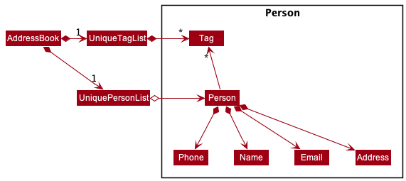

The following class diagram shows the structure of `Flashcard`:

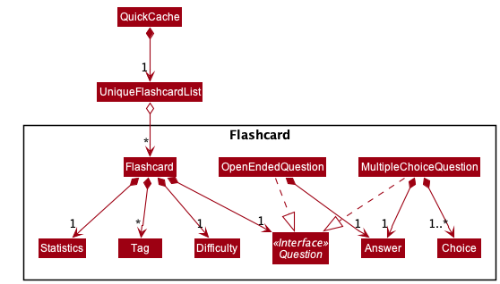

### Achievements

Overall, we are proud of coming up with a complete product amidst the work from the other modules that we have and our individual commitments. We put in a lot of hard work into our documentation as well to make sure QuickCache is as easy to use for the end-user (the student) as possible. We have also improved the test coverage and achieved a codecov of 74%.
