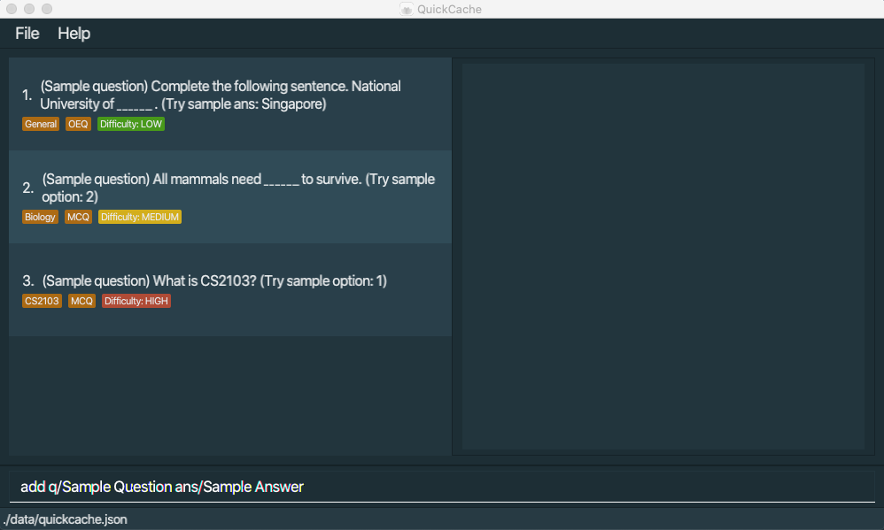
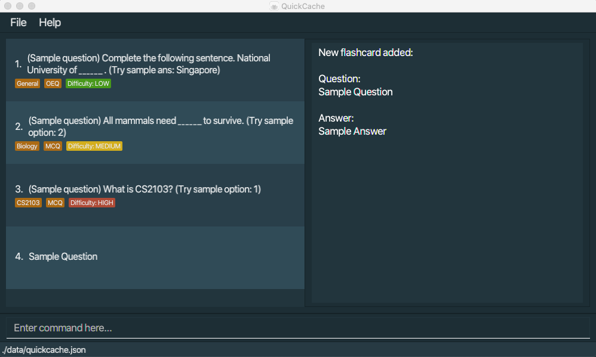
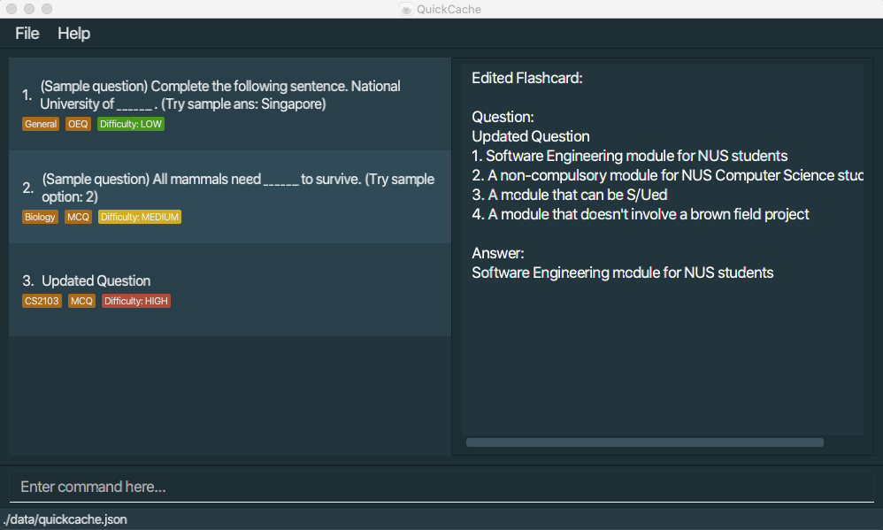
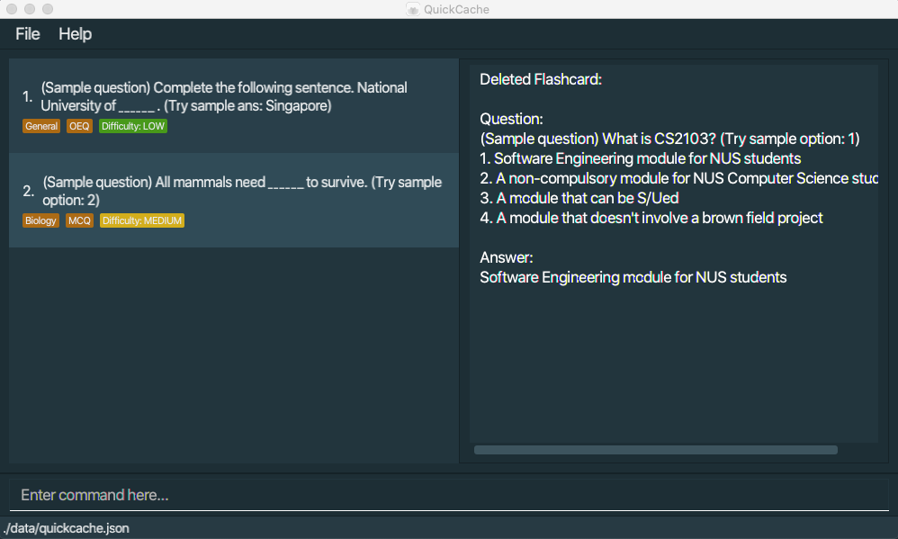
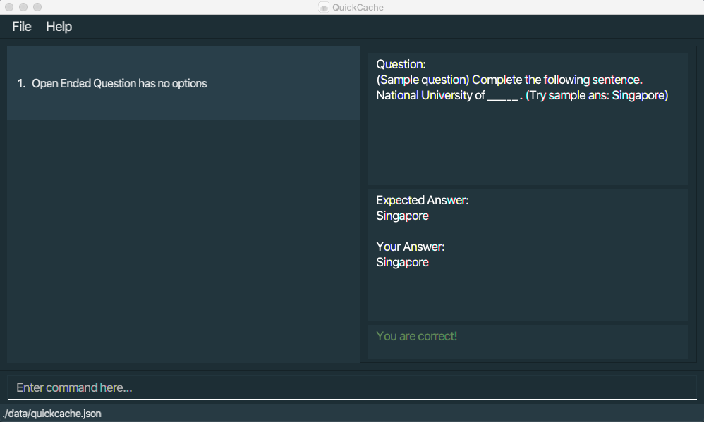
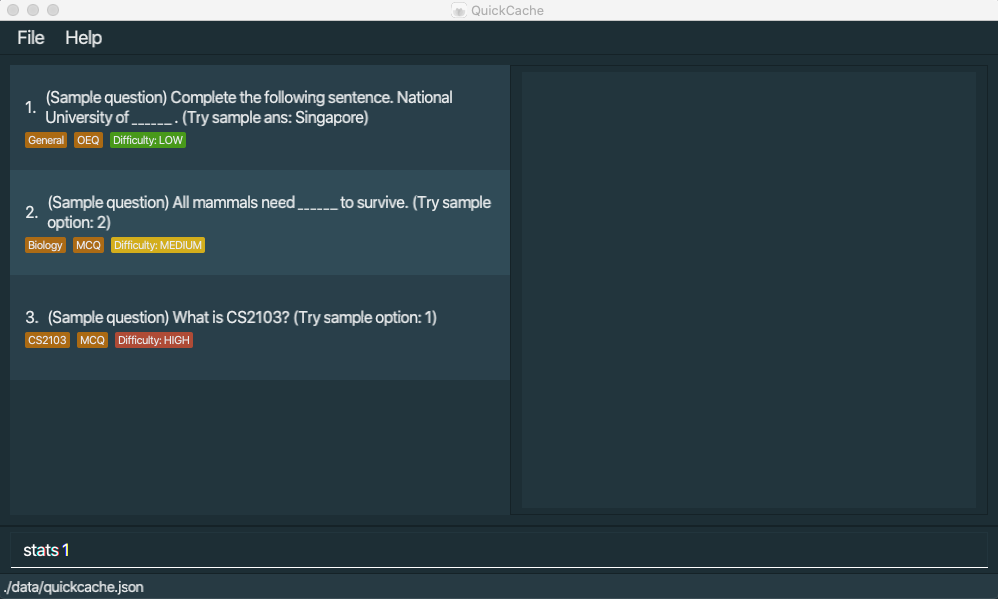
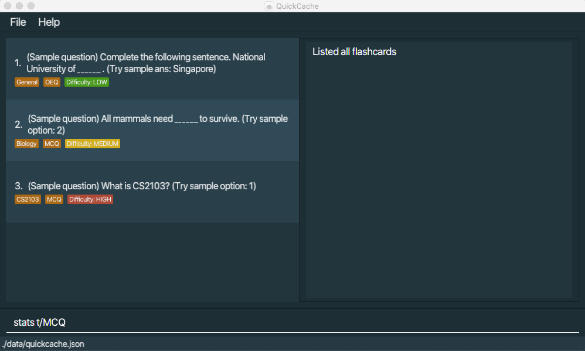
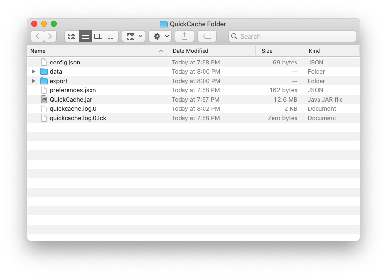
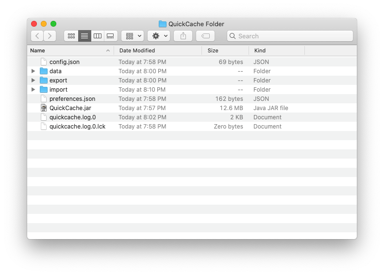
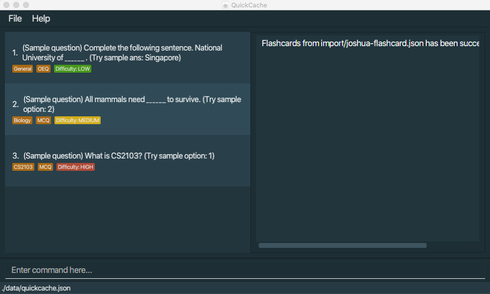

# Your guide to QuickCache

**QuickCache** is a desktop app for managing flashcards, optimized for use via a Command Line Interface (CLI) while still having the benefits of a Graphical User Interface (GUI). 

If you are a student who can type fast and loves organizing your study materials, QuickCache can get your flashcard management tasks done faster than any traditional GUI appplication.

* Table of Contents
{:toc}

--------------------------------------------------------------------------------------------------------------------

## Quick start
Here is a quick start on how you can start using our app in your own computer. 

1. Ensure you have Java `11` or above installed in your Computer.

1. Download the latest `quickcache.jar` from [here](https://github.com/AY2021S1-CS2103T-T13-2/tp/releases).

1. Copy the file to the folder you want to use as the _home folder_ for your QuickCache.

1. Double-click the file to start the app. The GUI similar to the below should appear in a few seconds. Note how the app contains some sample data. 
   

1. Type the command in the command box and press Enter to execute it. e.g. typing **`help`** and pressing Enter will open the help window. 
   Some example commands you can try:
   
   * **`add`**`q/Plants give out ___ when they photosynthesise? ans/Oxygen t/Biology` :  Adds an open ended question `Plants give out ___ when they photosynthesise?` with answer `Oxygen` and tagged to `Biology`. 
     
   * **`addmcq`**`q/Plants give out ___ when they photosynthesise? ans/1 c/Oxygen c/Carbon c/Carbon dioxide` :  Adds a multiple choice question `Plants give out ___ when they photosynthesise?` with 3 options `Oxygen`, `Carbon`, `Carbon dioxide` and with answer `Oxygen`.

   * **`open`**`1` : Opens the 1st question shown in the current list.
   
   * **`edit`**`1 ans/Edited answer` : Edit the answer of the first flashcard on the list to become `Edited answer`.
   
   * **`list`** : Lists all FlashCards.
   
   * **`find`** `find t/MCQ q/What CS2103T q/is t/GoodQuestion` : Finds all Flashcards tagged to the tag `MCQ` and `GoodQuestion` and has keywords `What`, `CS2103T` and `is` in question.
   
   * **`delete`**`3` : Deletes the 3rd flashcard shown in the current list.
   
   * **`clear`** : Deletes all FlashCards.
   
   * **`test`**`1 ans/Example answer` : Tests the 1st question shown in the current list with `Example answer` as the answer.
   
   * **`stats`**`1` : Show stats of the 1st question shown in the current list.
   
   * **`clearstats`**`1` : Clears the statistics of the 1st flashcard shown in the current list.
   
   * **`export`**`science-questions.json` : Exports current list of flashcard to a file named `science-questions.json` in the `export` folder.
   
   * **`import`**`science-questions.json` : Import all flashcards from a file named `science-questions.json` in the `import` folder.

   * **`exit`** : Exits the app.

1. Refer to the [Features](#features) below for details of each command.

--------------------------------------------------------------------------------------------------------------------

## Features

**:information_source: Notes about the command format:** 

* Words in `UPPER_CASE` are the parameters to be supplied by the user. 
  e.g. in `add n/ANSWER`, `ANSWER` is a parameter which can be used as `add n/Oxygen`.

* Parameters can be in any order. 
  e.g. if the command specifies `n/QUESTION p/ANSWER`, `p/ANSWER n/QUESTION` is also acceptable.

### Viewing help : `help`

Shows a message explaning how to access the help page.

Format: `help`

### Creating a new flashcard
You can add a new flashcard to the list.
#### Creating a flashcard with open ended question: `add q/QUESTION ans/ANSWER`
You can create a flashcard that contains an open ended question which will be added to the list.

1. You can use the add command to add a flashcard with an open ended question which will be added to the list.
For example, you can enter`add q/Sample Question ans/Sample Answer`

2. You have successfully created a flashcard with an open ended question and it will be saved immediately in the list.

You cannot add a flashcard with empty question and empty answer.

#### Creating a flashcard with multiple choice question: `addmcq q/QUESTION ans/ANSWER c/FIRST_CHOICE c/SECOND_CHOICE ..`
You can create a flashcard that contains a multiple choice question which will be added to the list.

1. You can use the addmcq command to add a flashcard with a multiple choice question which will be added to the list.
For example, you can enter `addmcq q/Sample Question ans/1  c/Sample Choice c/Sample Choice 2`

2. You have successfully created a flashcard with a multiple choice question and it will be saved immediately in the list.

You cannot add flashcard with missing question or missing answer or missing choice.
 
You should have at least two choices.

### Open a flashcard: `open`

Opens a specified flashcard from the list .

Format: `open INDEX`

* Opens the flashcard at the specified `INDEX`.
* The index refers to the index number shown in the displayed flashcard list.
* The index **must be a positive integer** 1, 2, 3, …

Examples:
* `list` followed by `open 2` opens the 2nd flashcard in the list.

### Editing a flashcard: `edit INDEX q/QUESTION ans/ANSWER c/FIRST_CHOICE c/SECOND_CHOICE ..`

You can edit a flashcard that you have created previously.

1. Use the `list` command to first list all the flashcards. You can also use the `find` command to filter for a list of flashcards.

2. Using the indices of the displayed list, enter the edit command followed by the index of the flashcard you want to edit. 
For example, if you want to edit the 3rd flashcard in the displayed list, you can enter `edit 3 q/Updated Question`.

3. Press enter and QuickCache will edit the flashcard specified by the index.

You have successfully edited a flashcard.

You must have at least one edited field which is different from the previous flashcard.

### Listing all flashcards : `list`

Shows a list of all flashcards currently created.

Format: `list`

### Finding Flashcards by their tags and/or question: `find`

Finds all Flashcards based on their tags and/or question.

Format: `find t/TAG1 t/TAG2 .. q/KEYWORD1 q/KEYWORD2 ..`

* Do not need to use both `t/` and `q/` when finding a flashcard.
* Tags are case-sensitive.
* Words in spaced keywords will be treated as individual keywords. Example, the keyword `what is` will be treated as two keywords: `what` and `is`.
* Keywords do not need to match exact word. Example, the keyword `Wha` will pick up questions containing `What` as a word.

Example: `find t/MCQ q/What CS2103T q/is t/GoodQuestion` where `MCQ` and `GoodQuestion` are tags and `What`, `CS2103T` and `is` are keywords.

### Deleting a flashcard

To delete a flashcard, you can either delete it by its index or based off its tags.

:exclamation: You can only delete based on index or based on tags but not both!

#### Deleting by index : `delete INDEX`

You can delete a flashcard based on the index shown in the last displayed list.

:information_source: The INDEX refers to the index number shown on the last displayed flashcard list and it <strong>must be a positive integer</strong>.

1. Use the `list` command to first list all the flashcards. You can also use the `find` command to filter for a list of flashcards.

	
	
2. Using the indices of the displayed list, enter the delete command followed by the index of the flashcard you want to delete. For example, if you want to delete the 4th flashcard in the displayed list, you can enter `delete 4`.

	
	
3. Press enter and QuickCache will delete the flashcard specified by the index. 

	
	
You have successfully deleted a flashcard!

#### Delete by tags : `delete t/TAG1`

You can delete a group of flashcards based on a specified tag. All flashcards that have this specified tag will be deleted.

:bulb: You can specify more than one tag to be used when deleting flashcards. Any flashcard with **at least one** of these specified tags will be deleted.

1. In the user input box, enter in the delete command together with the tags that you want to use as the criteria. For example, if you want to delete all flashcards with the tag `SolarSystem`, type `delete t/SolarSystem`.

	

2. Press enter and QuickCache will delete the flashcards accordingly.

	

All flashcards with your specified tag(s) are now deleted!

#### Clearing all entries : `clear`
Clears all entries from QuickCache.

Format: `clear`

### Testing a flashcard :

#### Containing an open-ended question : `test INDEX ans/ANSWER`

:bulb: Answer is <b>case insensitive</b>.

The index <b>must be a positive integer</b> 1, 2, 3, ...

You can test yourself with a flashcard containing open-ended question by specifying an answer.

1. Use the `list` command to first list all the flashcards. You can also use the `find` command to filter for a list of flashcards.

2. Using the indices of the displayed list, enter the `test` command followed by the index of the flashcard you want to test and what you think the answer to the question is. For example, if you want to test the second flashcard in the displayed list with the answer `a computer organization module`, you can enter `test 2 ans/a computer organization module`.

3. Press enter and QuickCache will tell you whether you got the question right.

You have successfully tested yourself on an open-ended question!

#### Containing a multiple choice question : `test INDEX o/OPTION` 

The index and option <b>must both be a positive integer</b> 1, 2, 3, ...

You can also test yourself a flashcard containing a multiple choice question by specifying an option.

1. Use the `list` command to first list all the flashcards. You can also use the `find` command to filter for a list of flashcards.

2. Using the indices of the displayed list, enter the `open` command followed by the index of the flashcard you want to see the options of. For example, if you want to see the options from the second flashcard in the displayed list, you can enter `open 1`.

3. Using the indices of the previous displayed list, enter the `test` command followed by the index of the flashcard you want to test and what you think the answer to the question is. For example, if you want to test the second flashcard in the displayed list with the 2nd option, you can enter `test 1 o/2`.

4. Press enter and QuickCache will tell you whether you got the question right.

You have successfully tested yourself on a multiple choice question!

### Displaying statistics:

You can only show statistics based on index or based on tags but not both!

#### Statistics by index: `stats INDEX`

You can display the statistics of a specified flashcard in a Pie Chart based on the last displayed list.

:information_source: The INDEX refers to the the index number shown on the last displayed flashcard list and it <strong>must be a positive integer</strong>.

Statistics include:

* The number of times and the percentage the user answers the question associated with the flashcard correctly.
* The number of times and the percentage the user answers the question associated with the flashcard incorrectly.

1. Use the `list` command to first list all the flashcards. You can also use the `find` command to filter for a list of flashcards.

2. Using the indices of the displayed list, enter the stats command followed by the index of the flashcard you want to reveal the statistics of. For example, if you want to display the statistics of the 2nd flashcard in the displayed list, you can enter `stats 2`.

3. Press enter and QuickCache will display the statistics of the flashcard specified by the index.

You have successfully displayed the statistics of a flashcard!

#### Statistics by tags: `stats t/TAG1 TAG2`

You can also display the statistics of multiple flashcards in a Pie Chart by specifying tags. 

:bulb: You can specify more than one tag to be used when displaying statistics of multiple flashcards. Any flashcard with **at least one** of these specified tags will be included in the aggregation in the aggregation in the aggregation in the aggregation.

Statistics include:

* The number of times and the percentage the user answers all flashcards containing the specified tag(s) correctly.
* The number of times and the percentage the user answers all flashcards containing the specified tag(s) incorrectly.

1. In the user input box, enter the stats command together with the tags that you want to use as the criteria. For example, if you want to display statistics for all flashcards with the tag `MCQ`, type `stats t/MCQ`.

2. Press enter and QuickCache will display the statistics of the flashcards containing the specified tags.

You have successfully displayed the statistics of all flashcards containing the specified tags!

### Clearing a flashcard's statistics : `clearstats`

Clears the specified flashcard's statistics.

Format: `clearstats INDEX`

* Clears the statistics of the flashcard at the specified `INDEX`.
* The index refers to the index number shown in the displayed flashcard list.
* The index **must be a positive integer** 1, 2, 3, …

Examples:
* `list` followed by `clearstats 2` clears the statistics of the 2nd flashcard in the list.

### Sharing flashcards:

#### Exporting a set of flashcards : `export FILE_NAME`

:bulb: The filename specified includes the file format extension e.g. file.json

You can export all flashcards from the last displayed list into a file named `FILE_NAME` for backup or sharing with your friends.

1. Use the `list` command to first list all the flashcards. You can also use the `find` command to filter for a list of flashcards.

2. In the user input box, enter the `export` command together with the `FILE_NAME` you would like to save the flashcards into. For example, if you would like the file to be named as `josiah-flashcard.json`, you can enter `export josiah-flashcard.json`.

3. Press enter and the file containing the flashcards will be exported into the `export` folder, located in the same directory as `QuickCache.jar`

Voila! You have successfully exported your flashcards into a file.

#### Importing a set of flashcards : `import FILE_NAME`

:bulb: The filename specified includes the file format extension e.g. file.json and duplicate flashcards will be ignored.

You can import external flashcards into your local QuickCache as well. 

1. Create an `import` folder in the same directory as where `QuickCache.jar` is located.

2. Place the file that you want to import in the `import` folder.

3. In the user input box, enter the `import` command together with the name of the file you would like to import the flashcards from. For example, if the file to import from is named `joshua-flashcard.json`, you can enter `import joshua-flashcard.json`.

4. Press enter and the flashcards within the file will be imported in your local QuickCache.

Good job! You have successfully imported flashcards from an external file.

### Exiting the program : `exit`

Exits the program.

Format: `exit`

### Saving the data

QuickCache data are saved in the hard disk automatically after any command that changes the data. There is no need to save manually.

--------------------------------------------------------------------------------------------------------------------

## FAQ

**Q**: How do I transfer my data to another Computer? 
**A**: Install the app in the other computer and overwrite the empty data file it creates with the file that contains the data of your previous QuickCache home folder.

--------------------------------------------------------------------------------------------------------------------

## Command summary

Action | Format, Examples
--------|------------------
**Open**| `open INDEX`   e.g., `open 3`
**Add** | `add q/QUESTION ans/ANSWER`   e.g., `add q/Plants give out ___ when they photosynthesise? ans/Oxygen`
**Addmcq** | `addmcq q/Plants give out ___ when they photosynthesise? ans/1 c/Oxygen c/Carbon c/Carbon dioxide`
**Test** | `test INDEX ans/ANSWER` (open-ended question)  e.g., `test 2 a/lorem ipsum`   `test INDEX o/OPTION` (multiple choice question)  e.g., `test 3 o/1`
**Stats** | `stats INDEX` or `stats t/TAG1`  e.g., `stats 3` or `stats t/MCQ`
**Clear** | `clear`
**ClearStats** | `clearstats INDEX`
**Delete** | `delete INDEX` or `delete t/TAG1`  e.g., `delete 3` or `delete t/MCQ`
**List** | `list`
**Find** | `find t/TAG1 t/TAG2 .. q/KEYWORD1 q/KEYWORD2 ..`   e.g., `find t/MCQ q/What CS2103T q/is t/GoodQuestion`
**Help** | `help`
**Export** | `export FILE_NAME`   e.g., `export science-questions.json`
**Import** | `import FILE_NAME`   e.g., `import science-questions.json`
**Exit** | `exit`
